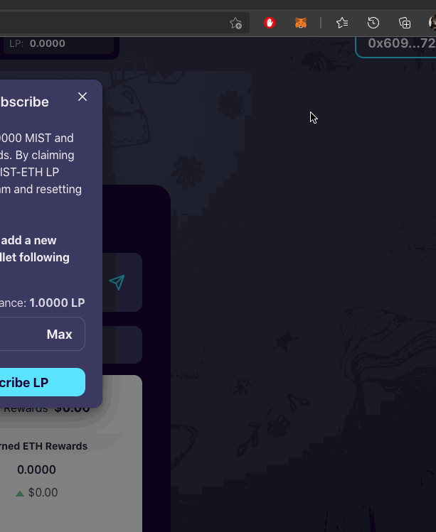
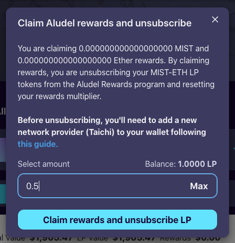
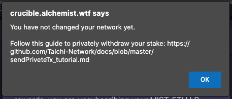
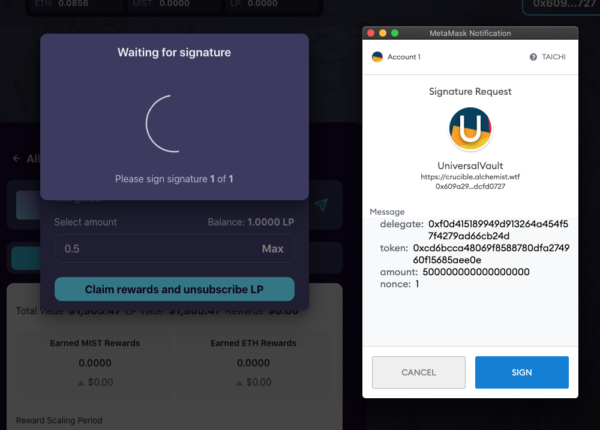
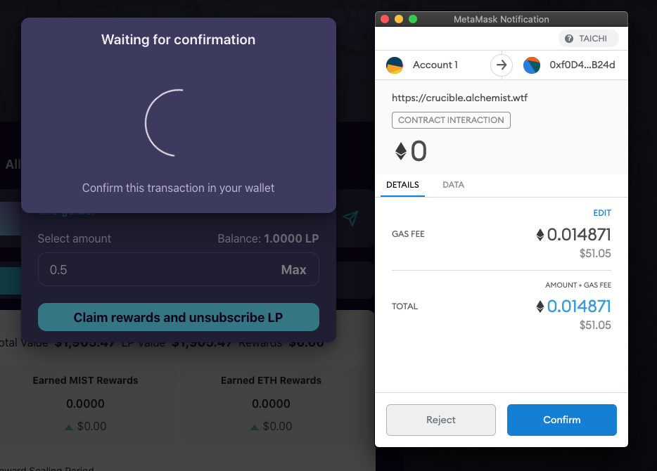

# Odbieranie nagród i anulowanie subskrypcji LP

W pewnym momencie możesz zdecydować, że jesteś gotowy, aby odebrać swoje nagrody \(Claim\) i zrezygnować z subskrypcji LP \(Unsubscribe\) swojego Crucible.

Poniższy przewodnik ma na celu przeprowadzenie Cię przez ten proces.


Będziesz musiał przełączyć się na sieć TaiChi, aby chronić swoją transakcję przed atakiem botów podczas anulowania subskrypcji/odbierania nagród.

Ten krok jest obowiązkowy, a instrukcje znajdują w poniższych krokach.


1. Otwórz [crucible.alchemist.wtf](https://crucible.alchemist.wtf/), połącz swój portfel i przejdź do zakładki "Your Crucibles".
2. Kiedy jesteś już na zakładce "Your Crucibles", za pomocą ikonki strzałki skierowanej w dół rozwiń szczegóły wybranego Crucible:

  
    

3. Twój Crucible powinien pokazywać teraz więcej informacji, takich jak ilość MIST oraz ETH które zarobiłeś w nagrodach  
4. Kliknij przycisk "Manage Crucible"  
5. Powinieneś teraz zobaczyć bardziej złożoną listę statystyk w zakładce "Rewards".   
6. Kliknij przycisk "Claim rewards and unsubscribe", który znajduje się na dole strony  
7. **Przed przejściem do następnego kroku,** będziesz musiał połączyć swój portfel do sieci TaiChi, skorzystaj z [tego linku, aby uzyskać szczegółowe informacje i instrukcje](https://github.com/Taichi-Network/docs/blob/master/sendPriveteTx_tutorial.md), poniżej wykonaliśmy animowany samouczek, aby przeprowadzić Cię przez ten proces.   
8. Upewnij się, że MetaMask pokazuje sieć TaiChi jak poniżej.

   

9. Teraz wróć na stronę internetową i wpisz w okienku ile LP chcesz anulować, a następnie kliknij "Claim rewards and unsubscribe LP".  
10. Jeśli nie wykonałeś poprawnie kroku 7-8, zobaczysz błąd. Jeżeli zobaczysz poniższy błąd to wróć do kroku 7 i spróbuj ponownie.   
11. Teraz zobaczysz wyskakujące okienko z MetaMask z żądaniem podpisu \(“Signature Request”\), kliknij “sign”   
12. Następnie otrzymasz powiadomienie o transferze środków z MetaMask, jak pokazano poniżej. **Sugerujemy sprawdzenie opłaty za gaz \(Gas Fee\) poprzez kliknięcie przycisku EDIT. Niektórzy użytkownicy zgłosili, że domyślna opcja jest najwolniejsza, co może opóźnić zakończenie transakcji. Jeśli obawiasz się, że opłaty za gaz są zbyt wysokie, użyj ethereumprice.org/gas/, aby zdecydować, kiedy opłaty za gaz mogą być najniższe**

     

13. Transakcja zostanie teraz wysłana do sieci TaiChi. Nie będziesz mógł od razu zobaczyć tej transakcji na etherscan, więc nie panikuj! Pojawi się tam, gdy transakcja przejdzie przez sieć TaiChi.
14. Jeśli chcesz sprawdzić, czy transakcja jest realizowana na TaiChi, możesz wkleić hash transakcji do [https://taichi.network/](https://taichi.network/), aby zobaczyć jej postęp **Uwaga:** Sieć TaiChi jest trochę wolniejsza niż sieć ethereum
15. Gdy transakcja przejdzie i zostanie zakończona, będziesz musiał przełączyć się z powrotem do sieci ethereum, aby wyświetlić Crucible

     

16. Kliknij odśwież, a zobaczysz Crucible z usuniętymi tokenami LP

\*\*\*\*

