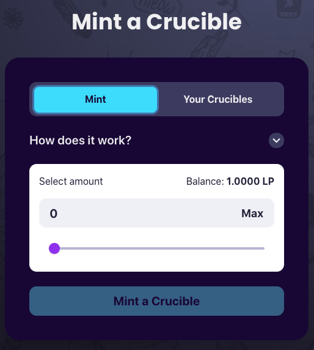
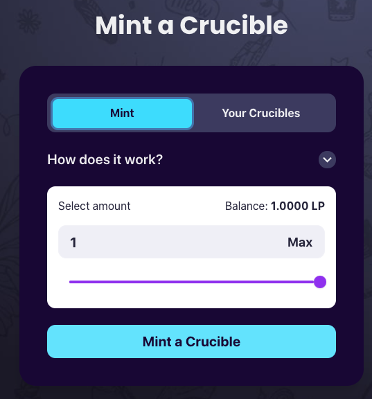
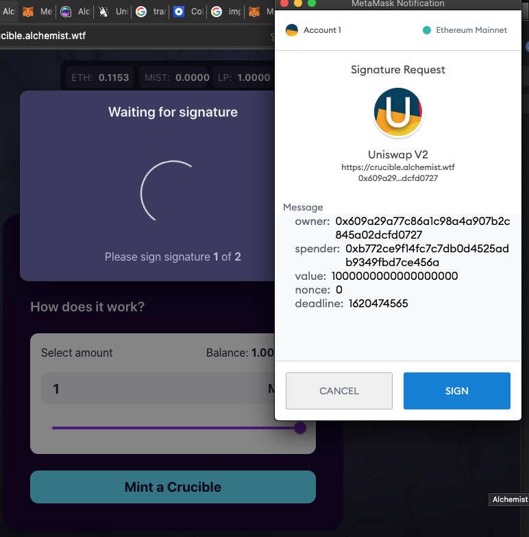
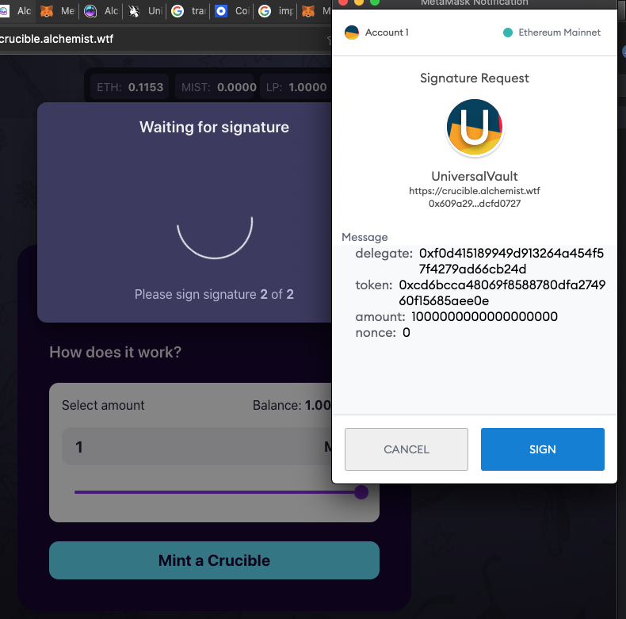
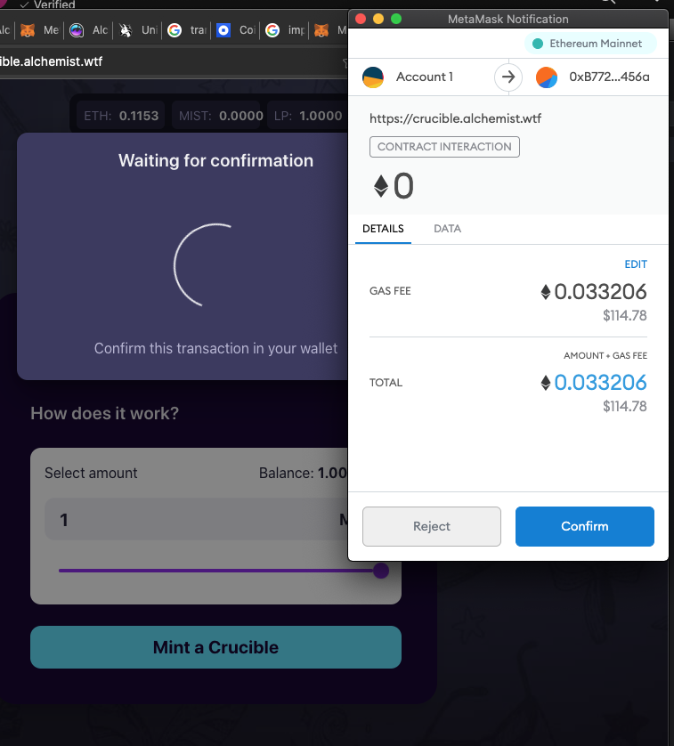
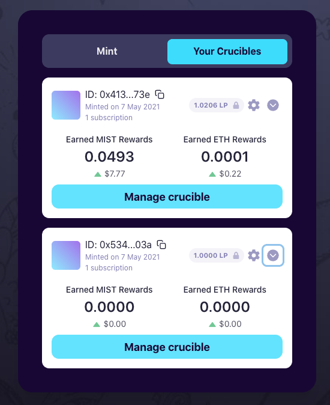

# 如何铸造Crucible？

## 交换和提供$MIST ⚗️来铸造一个Crucible

首先，你需要有$MIST并将其提供到Uniswap-V2流动池。

如果您还没有这样做，请参考我们关于[获取和提供](../../acquiring-and-subscribing.md)两部分指南。

## 使用LP代币铸造一个Crucible


**重要通知：**

不要使用Brave浏览器，因为它与目前的程序不兼容，你的交易将会失败，造成费用的损失。

我们目前不建议使用硬件钱包，因为许多硬件钱包目前不支持EIP-712签名。当他们解决了这个问题时，我们才可以去实施使用。

我们不建议您在手机上这样做。


### 一步一步的指引

1. 首先前往 [crucible.alchemist.wtf](https://crucible.alchemist.wtf/)
2. 使用 "Connect Wallet"按钮连接一个钱包。在这个例子中，我们将使用Metamask

    - 或 -  

3. 你应该会看到像这样的页面:

     

4. 输入你希望投入Crucible的LP数量。你可能想点击"Max"来输入你的全部数额。    
5. 点击 "Mint a Crucible"，通过MetaMask进行必要的授权，等待交易完成。 **注意：应该有2个签名请求和1个交易请求，如果它们没有弹出，你可能要打开MetaMask。**      
6. 一旦你确认了你的交易，你应该收到以下提示，点击查看你的交易。一旦你的交易被确认，请进入下一步。  
7. 现在你的交易已经确认，你可以关闭上面的弹出窗口，并点击"Crucibles"标签，这应该会显示你新铸造的Crucible。  

## 恭喜你，如果你走到这一步，你现在是一名**Alchemist**了。

