# ¿Qué puedo hacer con mi nuevo Crucible?

Hay una serie de cosas que puedes hacer con tu Crucible recién creado, a continuación están las cosas más comunes que puedes hacer usando crucible.alchemist.wtf

* [Comprobar las recompensas](https://app.gitbook.com/@alchemist-docs/s/mist/~/drafts/-M_ad0DGX1nFbyLsg8G0/v/spanish/crucible/guides-crucible.alchemist.wtf/what-can-i-do-with-my-new-crucible#checking-your-rewards)
* [Aumentar l](what-can-i-do-with-my-new-crucible.md#increasing-your-lp-subscription)[a suscripción de tu LP](https://app.gitbook.com/@alchemist-docs/s/mist/~/drafts/-M_ad0DGX1nFbyLsg8G0/v/spanish/crucible/guides-crucible.alchemist.wtf/what-can-i-do-with-my-new-crucible#increasing-your-lp-subscription)
* [Comprobar la cantidad de LP que has suscrito a tu Crucible](https://app.gitbook.com/@alchemist-docs/s/mist/~/drafts/-M_ad0DGX1nFbyLsg8G0/v/spanish/crucible/guides-crucible.alchemist.wtf/what-can-i-do-with-my-new-crucible#checking-how-much-lp-youve-subscribed-to-your-crucible)
* [Transferir tu Crucible a otro wallet](https://app.gitbook.com/@alchemist-docs/s/mist/~/drafts/-M_ad0DGX1nFbyLsg8G0/v/spanish/crucible/guides-crucible.alchemist.wtf/what-can-i-do-with-my-new-crucible#transferring-your-crucible-to-another-wallet)
* [Localizar y copiar la dirección de un Crucible](https://app.gitbook.com/@alchemist-docs/s/mist/~/drafts/-M_ad0DGX1nFbyLsg8G0/v/spanish/crucible/guides-crucible.alchemist.wtf/what-can-i-do-with-my-new-crucible#locating-and-copying-your-crucible-address)

## Comprobar las recompensas

1. Abre [crucible.alchemist.wtf](https://crucible.alchemist.wtf/), conecta tu cartera y visita la pestaña "Your Crucibles".
2. Una vez en la pestaña "Your Crucible", amplíe los detalles del Crucible que desea ver utilizando la flecha que mira hacia abajo: 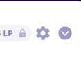 
3. Tu Crucible debería mostrarte más información, como la cantidad de MIST o ETH que has ganado en recompensas  
4. Si quieres más detalles sobre las recompensas , haz clic en el botón "Manage Crucible"  
5. Ahora debería aparecer una lista más compleja de estadísticas en la pestaña "Rewards", incluyendo información sobre el multiplicador de recompensas, el valor de tu posición y tu LP suscrito y no suscrito.  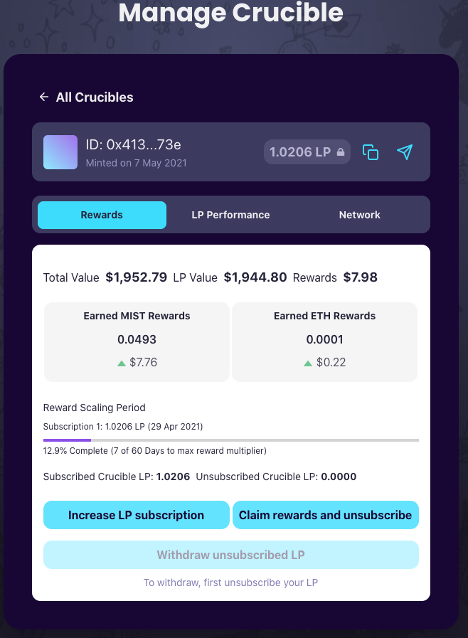 

## Aumentar la suscripción de tu LP

1. Sigue los pasos 1 - 5 de [Comprobar las recompensas](https://app.gitbook.com/@alchemist-docs/s/mist/~/drafts/-M_VHiL63dIBNcjxTUwi/v/spanish/crucible/guides-crucible.alchemist.wtf/what-can-i-do-with-my-new-crucible#checking-your-rewards)
2. Haz clic en el botón "Increase LP Subscription" 
3. Especifique la cantidad de LP que deseas aumentar tu suscripción y pulse "Increase Subscription"  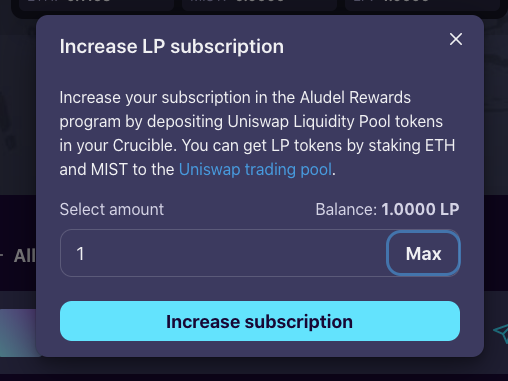 
4. Firma 2 solicitudes de firma y confirma la solicitud de transacción.. 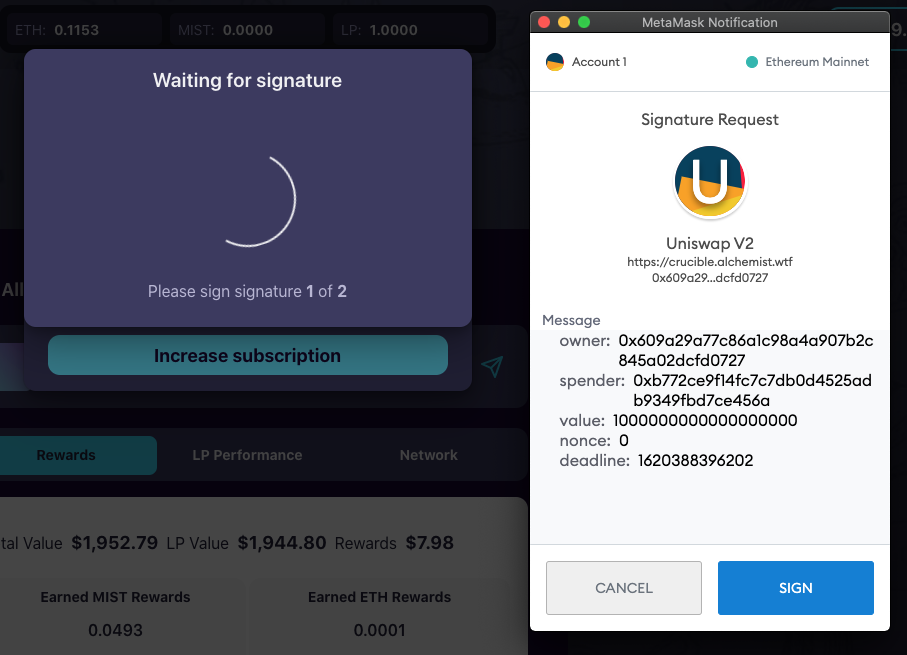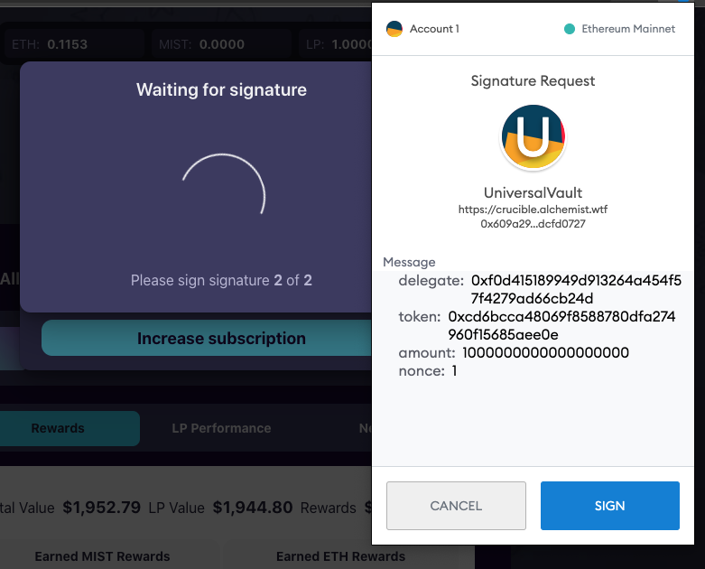 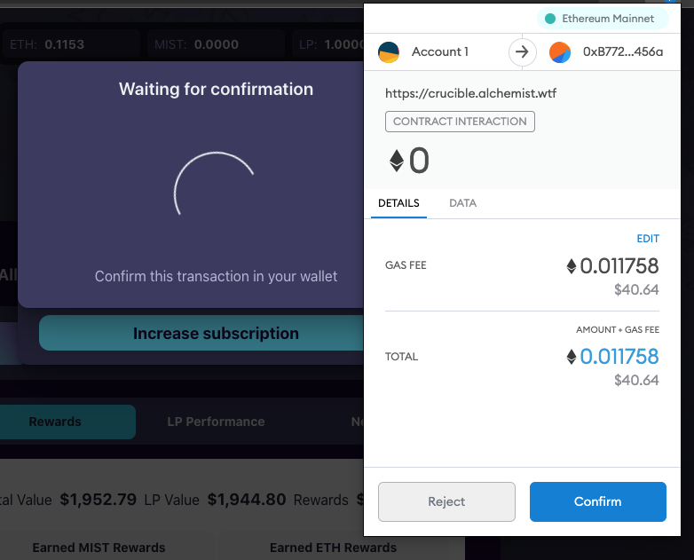 
5. Tu LP debería ser enviado para ser suscrito al Crucible, puedes ver tu transacción usando cualquiera de los avisos que aparecen después de que tu transacción ha sido enviada  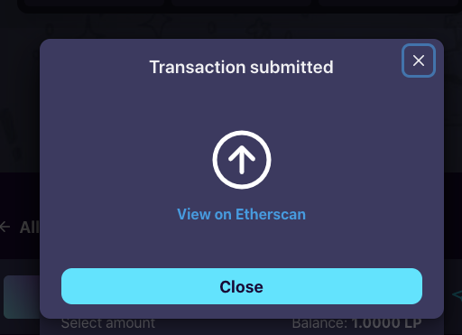 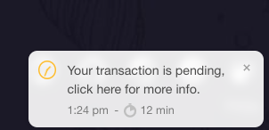 
6. Una vez completadas las transacciones, tu Crucible debería representar tu LP recién suscrito.

## Comprobar la cantidad de LP que has suscrito a tu Crucible

1. Sigue los pasos 1 - 5 de [Comprobar las recompensas](https://app.gitbook.com/@alchemist-docs/s/mist/~/drafts/-M_VHiL63dIBNcjxTUwi/v/spanish/crucible/guides-crucible.alchemist.wtf/what-can-i-do-with-my-new-crucible#checking-your-rewards)
2. Debería ver "Subscribed Crucible LP" y "Unsubscribed Crucible LP"

## Transferir tu Crucible a otro wallet

1. Sigue los pasos 1 - 5 de [Comprobar las recompensas](https://app.gitbook.com/@alchemist-docs/s/mist/~/drafts/-M_VHiL63dIBNcjxTUwi/v/spanish/crucible/guides-crucible.alchemist.wtf/what-can-i-do-with-my-new-crucible#checking-your-rewards)
2. Localiza tu resumen de Crucible que está abierto actualmente 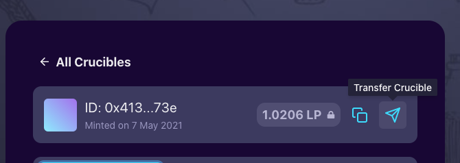
3. Localiza el icono del avión de papel en la parte derecha de tu Crucible y haz click 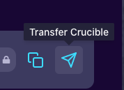 
4. Introduzca la dirección del wallet a la que deseas enviar el Crucible en el campo "Recipient Address" \(Debe ser compatible con ERC-721\) y haz clic en "Transfer Crucible". 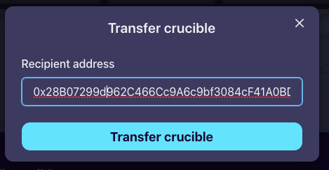 
5. Sé te pedirá que confirmes la transferencia, asegúrete de que la dirección del wallet es correcta antes de enviarla. 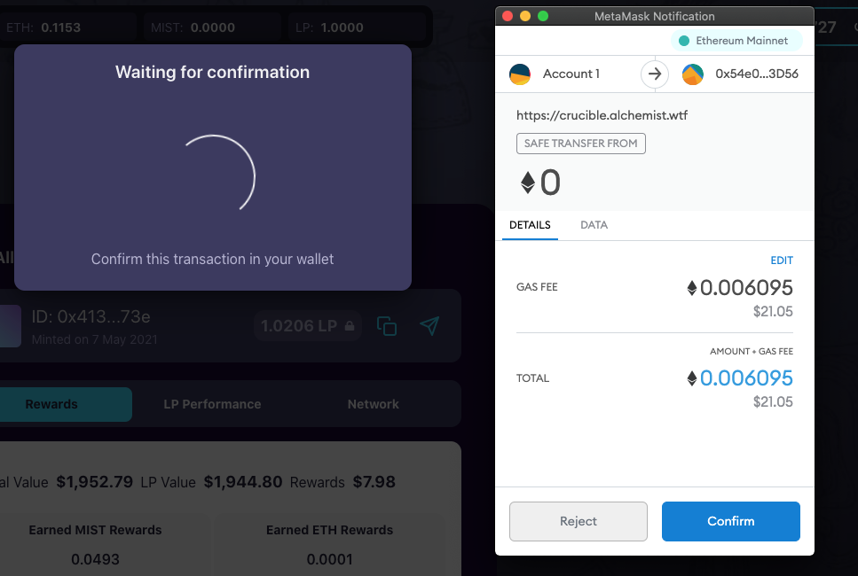 
6. El Crucible estará ahora de camino a su nuevo wallet, utilices los enlaces de las notificaciones para supervisar la transacción.  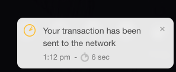  

## Localizar y copiar la dirección de un Crucible

1. Sigue los pasos 1 - 5 de [Comprobar las recompensas](https://app.gitbook.com/@alchemist-docs/s/mist/~/drafts/-M_VHiL63dIBNcjxTUwi/v/spanish/crucible/guides-crucible.alchemist.wtf/what-can-i-do-with-my-new-crucible#checking-your-rewards)
2. Localiza tu resumen de Crucible que está abierto actualmente

  
   

3. Localiza el icono de copia a la izquierda del avión de papel, haz clic en él y tu dirección del Crucible estará ahora en tu Clipboard. 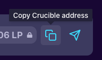

#### 

